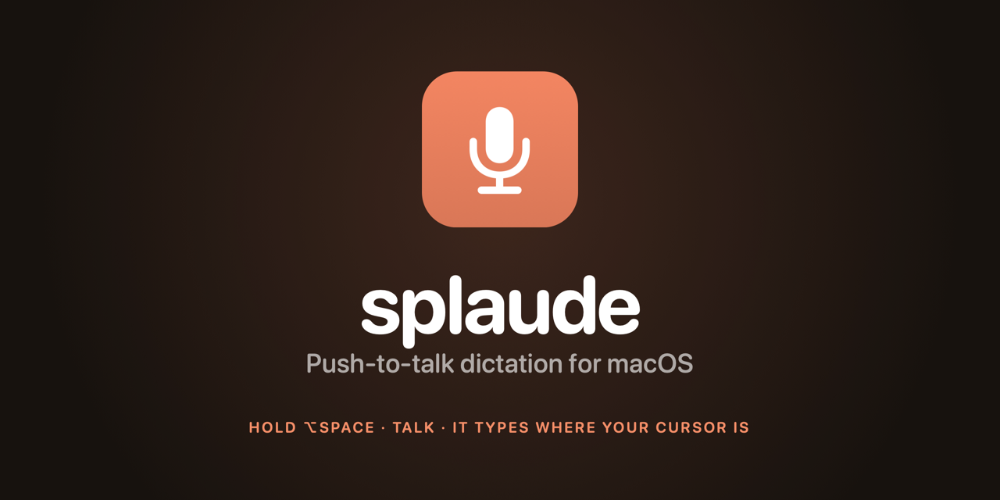

<p align="center">
  
</p>

# splaude

### Did you know Claude Code ships with transcription?

Neither did I — until a spent weekly limit left the mic button in the IDE
extension still working. It turns out that button talks to a speech endpoint
that never touches a Claude model, which is why the limit did not apply.

splaude points a macOS menu bar app at the same endpoint. Hold a hotkey, talk,
release — the text lands at your cursor in whatever app you were typing in, and
it appears **as you speak** rather than after you stop.

It authenticates with the Claude Code OAuth credential already on this machine,
so if you have run `claude` once, there is nothing else to set up.

> **Read this before installing.** That endpoint is undocumented and internal to
> Anthropic, and splaude is not an Anthropic product — it is a third-party
> client calling it with your credential. Anthropic has not sanctioned this.
> The endpoint can change or vanish in any release, and using it this way may
> run against the terms your Claude subscription is governed by; that is your
> call to make, and the risk to your account is yours. See
> [Caveat](#caveat) for what is actually known, and note that `SpeechBackend`
> is a three-method protocol — swapping in your own Deepgram key is one file.

## Install

Grab the latest zip from [Releases](https://github.com/bygelo/splaude/releases),
drag `splaude.app` to `/Applications`, then:

```sh
xattr -dr com.apple.quarantine /Applications/splaude.app
open /Applications/splaude.app
```

That second command is not optional. Releases are **ad-hoc signed, not
notarized** — notarizing needs a paid Apple Developer account — so Gatekeeper
refuses to launch the app until the quarantine flag is cleared. For the same
reason the signature changes on every release, and macOS treats each update as
a new app, so expect to grant Accessibility again after upgrading.

Building from source avoids both problems if you have a signing identity.

## Requirement

- macOS 14+, Apple Silicon
- A signed-in Claude Code install (`claude` in a terminal at least once)
- To build rather than download: Xcode command line tools (Swift 6)

## Build

```sh
make run        # build, install to /Applications, relaunch — use this one
make check      # credential + permission diagnostic, no UI
make            # build + assemble build/splaude.app only
make icon       # regenerate Resource/splaude.icns (only when the mark changes)
```

`Resource/splaude.icns` is committed, so a normal build never needs `make icon`.
It re-renders the mark from `Script/makeicon.swift` at every size an `.icns`
carries; `make icon TINT=E8763A` changes the colour. `Script/makebanner.swift`
renders `Asset/banner.png` the same way.

`make run` quits any running copy *before* replacing the bundle and re-registers
it afterwards. Swapping the app out from under itself leaves LaunchServices with
a stale registration and the next launch fails with `-600`.

To launch at login, add `/Applications/splaude.app` under
System Settings › General › Login Items.

## Use

| Gesture | Effect |
| --- | --- |
| Hold `⌥Space` | Dictate while held, insert on release |
| Tap `⌥Space` | Latch recording on; tap again to stop and insert |
| Floating mic button | Click to start or stop. Drag to move; position is remembered |
| Menu bar icon | Same toggle, plus a transcript preview you can click to copy |

The floating button is a non-activating panel that refuses key status, so
clicking it cannot steal focus from the field you are dictating into — an
ordinary window would, and the text would have nowhere to land.

The icon turns red while recording and doubles as an input level meter.

Text appears **as you speak**, typed straight into whatever holds the keyboard
focus, and corrects itself when the recogniser revises a word. Nothing waits
for you to stop talking.

That is not as simple as it sounds. The recogniser streams a provisional guess
that keeps changing until an utterance ends, so `LiveTyper` keeps a copy of
exactly what it emitted, diffs each new guess against it, backspaces only the
characters that actually differ, and types the replacement. Two rules keep it
safe:

- **Committed text is locked.** Once an utterance ends, its characters can
  never be backspaced over, so a revision cannot chew backwards into words you
  typed yourself.
- **Focus is checked before the first keystroke.** `FocusProbe` asks the
  accessibility API what owns the keyboard. If it is unambiguously not a text
  surface — a file list, a table, an image — live typing is refused and the
  take falls back to a single paste at the end. Backspaces sent into a file
  browser are not a bug worth risking.
- **The take is pinned to the field it started in.** Synthetic keystrokes go
  wherever focus is at the instant they are posted, so changing window
  mid-sentence would spray the rest of a dictation — backspaces included — into
  whatever you switched to. `FocusAnchor` records the field when you start
  talking; if focus leaves, typing pauses rather than following you, and
  resumes where it began when you come back.

A paused take loses nothing. `LiveTyper` keeps its own record of what it
emitted, so the first frame after focus returns diffs against that and types
the whole gap at once. If the take *ends* while you are still away, the held
text is written straight into the remembered field through the accessibility
API; where that is refused — Electron, terminals and most web views do not
support it — focus is handed back and the text pasted, which is the only
remaining route.

Turn it off under Dictation to get the older behaviour, where keystrokes follow
focus wherever it goes.

**Return ends the take.** Submitting is a statement that you are done talking —
in a chat box or a search field the words after it would land somewhere you
cannot see. The watcher is a global monitor, which observes without consuming,
so Return still sends whatever you were typing into; it only stops the
dictation. Turn it off under Dictation when writing prose, where Return is a
new paragraph rather than a full stop.

Synthetic keystrokes carry a cleared modifier state. Push-to-talk means Option
is usually physically held while typing happens, and `⌥Delete` deletes a whole
word.

## Permission

Three grants, each prompted on first use:

1. **Microphone** — System Settings › Privacy & Security › Microphone
2. **Accessibility** — needed to synthesise the paste keystroke
3. **Keychain** — the first run shows a dialog asking to read the
   `Claude Code-credentials` item. Click *Always Allow* so it stops asking.

The build signs with the first code signing identity on the machine, falling
back to ad-hoc. That matters: TCC pins the Accessibility grant to the
signature, and an ad-hoc one gets a new cdhash on every rebuild, so you would
re-grant after each `make`. Override with `make SIGN="Some Identity"`.

## When it misbehaves

Every failure here looks the same from outside — "nothing happened" — so the
menu carries two probes and the app keeps a log at
`~/Library/Logs/splaude.log` (menu › Reveal Log).

- **Test Paste** exercises insertion alone, with no mic or network involved. If
  this fails but the menu shows transcript text, the problem is Accessibility.
- **Accessibility: …** shows the grant state and opens the right settings pane.
- The log records the audio format, bytes captured, peak input level, socket
  open/close, each committed utterance, and every paste attempt. `sent 0 bytes`
  means the mic never opened; bytes with `peak level 0.00` means it opened onto
  silence; neither is a transcription problem.

If a paste is refused the text is left on the clipboard, so a missing
permission costs you a `⌘V` rather than the whole take.

### The credential expires

splaude *reads* the Claude Code OAuth token; it never *refreshes* it. That is
Claude Code's job, and it only happens while Claude Code runs. The token lasts
hours, not weeks, so an install that is never opened alongside `claude` will
eventually find it dead.

Rather than let that surface as a take that mysteriously fails, the menu warns
before it matters — within ten minutes of expiry, and again once expired — and
the warning opens a note explaining the fix, with `claude` already on your
clipboard. Settings › Status shows the exact expiry, and `make check` prints it
from the command line.

## Does it spend Claude quota?

No, and the app now shows its work rather than asking you to take that on faith.

The connection sets `stt_provider=deepgram-nova3`. No Claude model is invoked,
so there are no Claude tokens to spend — which matches the original
observation that the extension's mic keeps working at a spent weekly limit.

`QuotaWatch` records the WebSocket handshake response. Anthropic's
Claude-metered endpoints answer with `anthropic-ratelimit-*` headers describing
remaining requests and tokens; if the speech socket returns none, nothing on
that meter was touched. Settings › Status shows what came back, and the log
records every header name seen:

```
[quota] handshake HTTP 101
[quota] no rate-limit headers — nothing metered on this connection
[quota] all headers: connection, date, sec-websocket-accept, upgrade
```

That is client-side evidence, not a guarantee about billing. For an
end-to-end check, note your limit in `claude` with `/usage`, dictate for a few
minutes, and read it again — the number should not move.

## Settings

Menu bar › **Settings…** (`⌘,`), in four tabs:

| Tab | What's there |
| --- | --- |
| Dictation | Type-as-I-speak, focus guard, input anchoring, typing speed, language, hotkey recorder |
| Vocabulary | Your keyterms, built-in developer list toggle, live budget meter |
| General | Floating mic button, start/stop sound, launch at login, log |
| Status | Accessibility, microphone, credential, and what the handshake said about quota |

Everything is still a plain default underneath, so the command line works too:

```sh
defaults write com.bygelo.splaude keyterm -array "Ateneo" "OrSem" "Supabase"
defaults write com.bygelo.splaude liveTyping -bool false    # paste once at the end
defaults write com.bygelo.splaude typingInterval -int 600   # µs between keystrokes
```

`liveTyping` is on by default. Turning it off reverts to buffering the whole
take and pasting it in one go — slower to appear, but it never touches the
delete key, which is the safer choice in an app that mishandles synthetic
keystrokes.

Live typing also sets `forward_interims=typed` on the connection, which asks
the server to punctuate and case interim results as they stream rather than
only at utterance boundaries. The extension hides the same flag behind
`CLAUDE_CODE_VOICE_FORWARD_INTERIMS_TYPED`.

`keyterm` biases the recogniser toward words it would otherwise mangle — proper
nouns, project names, jargon. It is appended to a built-in developer list and
capped at 1024 characters, matching the server's budget. This is the single
highest-leverage setting for accuracy.

## How it works

```
AudioCapture          AVAudioEngine tap → AVAudioConverter → 16 kHz mono int16
AnthropicSpeechBackend WebSocket, keepalive every 8 s, CloseStream on finish
TranscriptBuffer      interim frames replace, endpoint frames commit
TextInserter          pasteboard snapshot → set → ⌘V via CGEvent → restore
Hotkey                Carbon RegisterEventHotKey, press + release
```

The endpoint, its query parameters and the frame types were read out of
`anthropic.claude-code-*/extension.js`:

```
wss://api.anthropic.com/api/ws/speech_to_text/voice_stream
  ?encoding=linear16&sample_rate=16000&channels=1
  &endpointing_ms=300&utterance_end_ms=1000&language=en
  &use_conversation_engine=true&stt_provider=deepgram-nova3
Authorization: Bearer <oauth token>
x-app: vscode
x-config-keyterms: <comma-joined terms>
```

Frames in: `TranscriptInterim` and `TranscriptText` are provisional,
`TranscriptEndpoint` commits the pending text, `TranscriptError` / `error`
report failure. Frames out: raw PCM binary, `{"type":"KeepAlive"}`,
`{"type":"CloseStream"}`.

## Caveat

`stt_provider=deepgram-nova3` — the recogniser is Deepgram Nova-3 behind an
Anthropic proxy, not a Claude model. That is why it keeps working when the
Claude weekly limit is exhausted: no Claude tokens are spent.

This is an undocumented internal endpoint being called from a non-Anthropic
client. It can change or vanish in any release, and "unmetered today" is not a
promise. If it breaks, `SpeechBackend` is a three-method protocol — a Deepgram
implementation with your own key talks the same JSON and takes the same audio,
so it is one new file and one line in `openStream`.
